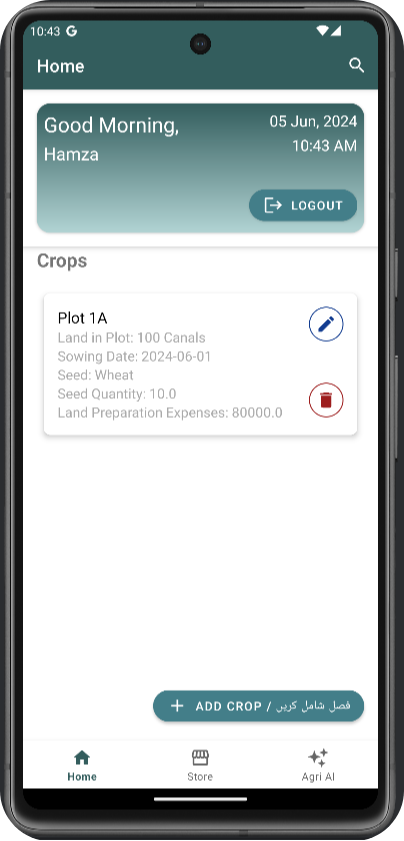

# AgriSmartPro Mobile App

**Developer:** Hamza

## Project Overview

AgriSmartPro mobile app is an innovative agricultural tool designed to empower farmers with advanced technological features directly accessible from their smartphones. The primary objective of the AgriSmartPro mobile app is to optimize farm management by providing real-time data, actionable insights, and AI-driven recommendations. The app helps farmers make informed decisions, streamline inventory management, and improve crop yields through an easy-to-use interface.

## Background

Agriculture has been the backbone of human civilization, relying on traditional methods passed down through generations. However, with the rapid advancements in technology, there is a growing need to integrate modern tools into farming practices. The AgriSmartPro mobile app addresses this need by offering a comprehensive digital solution that leverages AI and real-time data to assist farmers in Pakistan, where 70% of exports are linked to agriculture, and 47% of the land is agricultural. The app aims to bridge the gap between traditional farming methods and modern technological solutions to enhance productivity and sustainability.

## Key Features

- Comprehensive Inventory Management
- Mobile App with Chatbot Integration
- User-friendly Interface

## Mobile Application Features

### Login/Signup

The AgriSmartPro login screen provides a simple and secure way for users to access their accounts. Users have multiple options to log in or register for a new account.

- Email and Password Login
- Google Sign-In
- New User Registration
- Password Recovery

### Home Screen

The AgriSmartPro home screen provides a personalized and comprehensive overview of the user's farming activities. The interface is designed to be intuitive and informative.

- Greeting Message
- Logout Button
- Crops Section
- Add Crop Button

### Store Fragment

The Store fragment in AgriSmartPro comprises three sections for managing inventory: Seeds, Fertilizers, and Pesticides. Each section allows users to store and manage detailed information about the respective items.

- Seeds Section
- Fertilizers Section
- Pesticides Section

### Agri AI Fragment

The Agri AI fragment in AgriSmartPro integrates a chatbot powered by Google Gemini to assist users with crop-related inquiries. Users can interact with the chatbot by sending images of their crops and asking questions about potential issues. The chatbot analyzes the images and provides diagnostic information and suggestions.

- Image Analysis
- Text Interaction

